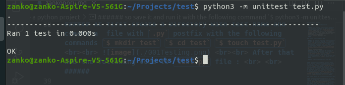
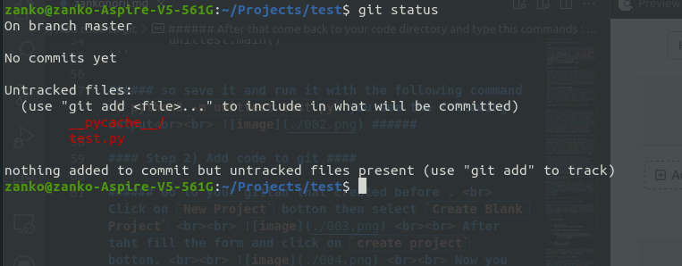

# Install Gitlab on ubuntu #

#### Step 1) Installing the Dependencies
 ####

 ###### At first we should installing the  dependecies . <br> first step is updating our ubuntu repository with the following code <br> ` $ sudo apt-get update `
  <br> ` $ sudo apt-get upgrade ` <br>  <br> Now, using the following command, you will install the gitlab package dependencies. <br> `$ sudo apt-get install -y curl openssh-server ca-certificates
` <br><br> 
 ######

#### Step 2) Installing GitLab ####

 ###### In the next step we going to installing and run gitlab on the <strong><i> ubuntu OS </i></strong><br> Move to `/tmp` directory for downloading gitlab file . <br> <li><i>Note : </i></li> `/tmp` is a file in linux that after each reastart is clean. <br> after that we try to get a file that have gitlab source with following code <br> `curl -LO https://packages.gitlab.com/install/repositories/gitlab/gitlab-ce/script.deb.sh`
 
 ###### With the above commands we add GitLab to our ubuntu repository <br> After that try to install gitlab service with the following command <br> `$sudo apt-get install gitlab-ce` <br><br>  <br> After installing successfully the Gitlab you can see the following code on your terminal <br><br>  <br>
 ######

 #### Step 3) Adjusting the Firewall Rules ####


###### Before you configure GitLab, you will need to ensure that your firewall rules are permissive enough to allow web traffic. <br> With the following code we can see status of active  firewall `$ sudo ufw status`  <br><br>  <br><br> on the picture above you can see my server firewall status. port 22 is for ssh (remote control with terminal). <br> We should open <i>http</i> <i>https</i> and <i>OpenSSH</i> ports for ability to connecto server, do that with following comands <br><br> `$ sudo ufw allow http` <br> `$ sudo ufw allow https` <br> `$ sudo ufw allow OpenSSH` <br><br> Now you can check firewall status <br><br>  <br><br> ######

#### Step 4) Editing the GitLab Configuration File ####

###### Before you can use the application, you need to update the configuration file and run a reconfiguration command. First, open Gitlab’s configuration file: <br><br> `$ sudo nano /etc/gitlab/gitlab.rb ` <br><br> Near the top is the <i>`external_url`</i> configuration line. Update it to match your domain. Change http to https so that GitLab will automatically redirect users to the site protected by the Let’s Encrypt certificate. <br><br>  <br> ######

###### Next, look for the <i>`letsencrypt['contact_emails'] `</i> setting. This setting defines a list of email addresses that the Let’s Encrypt project can use to contact you if there are problems with your domain.<br><br>   <br><br>  Now run the following command to reconfigure Gitlab <br> `$ sudo gitlab-ctl reconfigure` <br><br> At first you see an output like this <br><br>  <br><br> At the end you see this output <br><br>  ######

#### Step 5) Performing Initial Configuration Through the Web Interface ####

###### Visit the domain name of your GitLab server in your web browser <br> `https://example.com`  <br> Now you see a sing page like this : <br><br>  <br><br> After Login you can see a page like this <br><br>  <br><br> You are admin and you can manage your personal gitlab now. ######
<br><br><br>

# Run a test in gitlab ci/cd env #

#### Step 1) Create a python project ####

###### At first create a Directory with test name and create a  file with `.py` postfix with the following commands `$ mkdir test` `$ cd test` `$ touch test.py`  <br><br>  <br><br> After that add the following code to `test.py` file : <br> <br>  ######

``` 
    import unittest


    def returnAnValue():
        return "this is a test for python"

    class TestSum(unittest.TestCase):

        def test_return_an_value_function(self):
            self.assertEqual(returnAnValue(), "this is a test for python")


    if __name__ == '__main__':
        unittest.main()
```

###### so save it and run it with the following command `$ python3 -m unittest test.py` you see the following output<br><br>  ######

#### Step 2) Add code to git ####

###### Go to your gitlab that created before . <br> Click on `New Project` botton then select `Create Blank Project` <br><br>  <br><br> After taht fill the form and click on `create project` botton. <br><br>  <br><br> Now you have a screen like this <br><br>  <br><br> then click on the clone finally copy ssh or http <br><br>  <li><i>Note : </i> for using ssh you should set your device public ssh key on the gitlab .</li> ######

###### After that come back to your code directory and type this commands : <br><br> ######

- [x] `$ git init` <small>This command create an `.git` file and initialize our project </small>
- [x] `$ git remote add origin git@gitlab.example.com:root/test.git` <small>This command add created git repository to our project.  </small>
- [x] `$ git status` <small>This command show status of project , resoult is something like this </small> <br>
  
  <small>for save changing on the git shoul commit our changes, so : </small>
    - [x] `# git add .` <small> add all changes to git stage </small>
    - [x] `# git commit -m "starting project"` <small> commit all files. </small><br>

- [x] <small>Now is time to sending our code to the Gitlab server : </small>
  - [x] `$ git push origin master` <small> This command send files to git repository `master` is name of our branch.</small> <br>
  

  - [x] <small> After that we can see our codes on the git repository </small> <br> 

- [x] <small> Now create a ci/cd env on our git  </small>
  - [x]  <small>Select  `CI/CD` From menu list .</small>
  - [x]  <small>Go to `Piplines` selection and use a template that you want .</small> <br>
  
  - [x] <small>I create my custome `*.yml` File with the following code : </small>
  ``` 
  image: python:latest

    stages:
    - build
    - test
    - deploy

    before_script:
    - python --version  


    build-job:      
    stage: build
    script:
        - echo "Compiling the code..."
        - echo "Compile complete."

    unit-test-job:
    stage: test
    script:
        - echo "Running unit tests..."
        - python -m unittest test.py

    lint-test-job:
    stage: test 
    script:
        - echo "Linting code... This will take about 10 seconds."
        - sleep 10
        - echo "No lint issues found."

    deploy-job:      
    stage: deploy  
    script:
        - echo "Deploying application..."
        - echo "Application successfully deployed."

  ```
  - [x] <small>commit and save changes.</small>
- [x] <small>After that go to `Pipelines` or `Jobs` to see running test, you see a page like this :  </small> <br> 
  
  <br>
  <small>The above picture show us that we have 3 stage in our test .</small>
      - [ ] `Build`  
      - [ ] `Test`  
      - [ ] `Deploy`   
  <small>green color show us test passed , <br> blue color show that test is running , <br> and red color show us test failed</small> 